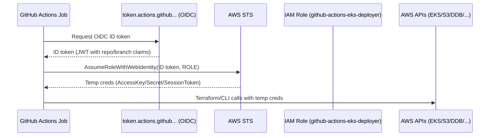
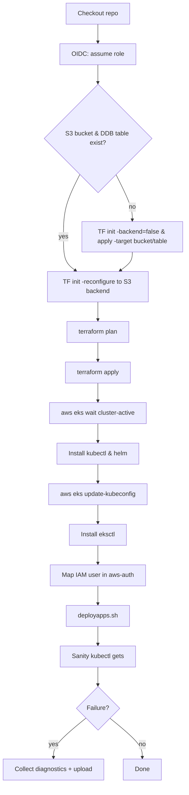

# Ushasree Stores – Infra CI/CD (GitHub Actions + AWS OIDC)

A practical, end‑to‑end record of how we set up Infrastructure-as-Code (Terraform) + EKS app deploys using **GitHub Actions** with **AWS OIDC**, including **why** we made each decision, common errors we hit, and how we fixed them.

---

## 0) Goals
- One pipeline that:
  1. Authenticates to AWS **without long‑lived keys** (OIDC).
  2. Creates/updates AWS infra with Terraform (VPC, EKS, RDS, etc.).
  3. Uses **remote state** in S3 with DynamoDB locking (team‑safe).
  4. Waits for EKS to be ready, configures `kubectl`/`helm`.
  5. Deploys cluster addons and apps via our `eks-apps/deployapps.sh` script.
  6. Grants **local** (laptop) access to the cluster automatically.
- Make the flow **idempotent**: re‑runs don’t recreate resources.

---

## 1) Repository layout (relevant parts)
```
uss-infrastructure/
├─ Infra/                 # Terraform root (providers, modules, backend resources)
│  ├─ main.tf
│  ├─ variables.tf
│  ├─ outputs.tf
│  └─ modules/
│     ├─ vpc/
│     ├─ eks/
│     └─ rds/
└─ eks-apps/              # Shell scripts & manifests that configure the cluster
   └─ deployapps.sh
```

---

## 2) Why OIDC (vs Access Keys)
- **Security**: No static access keys in GitHub. Short‑lived credentials are minted per run.
- **Rotations**: Automatic; nothing to rotate in the repo.
- **Blast radius**: Tight trust policy that only allows this repo/branch to assume the role.

---

## 3) AWS OIDC – What we created

### 3.1 OIDC Identity Provider (one‑time per account)
Points AWS IAM to GitHub Actions’ token issuer.
```bash
aws iam create-open-id-connect-provider   --url https://token.actions.githubusercontent.com   --client-id-list sts.amazonaws.com   --thumbprint-list 6938fd4d98bab03faadb97b34396831e3780aea1
```

### 3.2 IAM Role for GitHub Actions
**Trust policy** (restrict to this repo/branch):
```json
{
  "Version": "2012-10-17",
  "Statement": [
    {
      "Effect": "Allow",
      "Principal": {
        "Federated": "arn:aws:iam::<ACCOUNT_ID>:oidc-provider/token.actions.githubusercontent.com"
      },
      "Action": "sts:AssumeRoleWithWebIdentity",
      "Condition": {
        "StringEquals": { "token.actions.githubusercontent.com:aud": "sts.amazonaws.com" },
        "StringLike": { "token.actions.githubusercontent.com:sub": "repo:<GH_OWNER>/<REPO>:ref:refs/heads/main" }
      }
    }
  ]
}
```
Create role & attach permissions (start broad; tighten later):
```bash
aws iam create-role   --role-name github-actions-eks-deployer   --assume-role-policy-document file://trust-policy.json

aws iam attach-role-policy   --role-name github-actions-eks-deployer   --policy-arn arn:aws:iam::aws:policy/AdministratorAccess
```
Save the role ARN into GitHub **Actions → Secrets** as `AWS_ROLE_TO_ASSUME`.

---

## 4) Terraform: provider & backend strategy

### 4.1 Provider – **no static keys**
```hcl
provider "aws" {
  region = "ap-south-1"
}
```
All creds are injected by the GitHub OIDC step.

### 4.2 Remote state bootstrap (chicken‑and‑egg solved)
Problem: We want to **use** S3/DynamoDB as backend, but those are **created by Terraform**. Terraform can’t init the S3 backend until the bucket/table exist.

**Solution (2‑phase):**
1) **Bootstrap phase** with **local** backend: `terraform init -backend=false` then `terraform apply -target=...` to create **only** the S3 bucket & DynamoDB table.
2) **Re‑init** Terraform: `terraform init -reconfigure` with `-backend-config=...` (bucket/key/region/table).
3) Now run normal `plan`/`apply` for the rest of infra.

This is coded into the workflow as a conditional (only bootstraps if bucket/table missing).

---

## 5) GitHub Actions – Final Workflow (what it does)

**High‑level flow:**
1. **OIDC auth** to AWS using `AWS_ROLE_TO_ASSUME`.
2. **Check** S3 bucket / DynamoDB lock table; **bootstrap** if missing.
3. **Init** to S3 backend (reconfigure) → **plan** → **apply** Terraform.
4. **Wait** for EKS to be `ACTIVE`.
5. Install **kubectl** and **helm**; update kubeconfig; basic health check.
6. Install **eksctl** and **map local IAM user** to `system:masters` in `aws-auth` (so laptop access works).
7. Run `eks-apps/deployapps.sh` to install addons/apps.
8. Sanity `kubectl get` calls; collect diagnostics if anything fails.

> The workflow is idempotent. Terraform and Helm will converge to desired state.

We also switched `kubectl version` to `--client=true -o yaml` (the old `--short` flag is removed in newer kubectl).

---

## 6) Local access to EKS (laptop)
- Your IAM principal is **Admin** at the account level (policy `"Action":"*","Resource":"*"`).
- You still need **cluster‑level** mapping in `aws-auth` to be recognized by Kubernetes RBAC.

The pipeline ensures this with:
```bash
eksctl create iamidentitymapping   --region ap-south-1   --cluster ushasreestores-eks   --arn arn:aws:iam::182462214834:user/Vishnuvardhan   --username vishnu   --group system:masters
```
After a successful run, on your laptop:
```bash
aws sts get-caller-identity
aws eks update-kubeconfig --name ushasreestores-eks --region ap-south-1
kubectl get nodes
```
If it ever complains about credentials on the laptop, print what token command `kubectl` is executing and run it manually:
```bash
kubectl config view --minify -o jsonpath='{.users[0].user.exec.command} { .users[0].user.exec.args[*] }' ; echo
# example:
aws --region ap-south-1 eks get-token --cluster-name ushasreestores-eks --output json
```

> **Best practice (later):** Map an **IAM role** (e.g., `EKSAdmins`) in aws‑auth and have users assume it locally instead of mapping raw users.

---

## 7) Issues we hit & fixes

| Symptom / Error | Root Cause | Fix |
|---|---|---|
| `Terraform exited with code 3` | `terraform fmt -check` found formatting differences | Remove/relax fmt gate in CI or run `terraform fmt -recursive` and commit. |
| `Backend initialization required, please run "terraform init"` | Init to S3 backend missing / done too early | Two‑phase bootstrap: init with `-backend=false` → create bucket/table → `init -reconfigure` → plan/apply. |
| `Could not load credentials from any providers` in `configure-aws-credentials` | Step had neither role‑to‑assume nor access keys | Use OIDC: pass `role-to-assume: ${{ secrets.AWS_ROLE_TO_ASSUME }}` and ensure `permissions: id-token: write`. |
| `kubectl version --short` → `unknown flag: --short` | Newer kubectl removed `--short` | Use `kubectl version --client=true -o yaml`. |
| Local: `no such host` for EKS endpoint | Temporary DNS/VPN issue | Retry / switch network; typically transient. |
| Local: `the server has asked for the client to provide credentials` | IAM principal not mapped in `aws-auth` (or AWS CLI not on PATH) | Map user via `eksctl create iamidentitymapping`; ensure `aws` is on PATH; regenerate kubeconfig. |

---

## 8) Security & reliability notes
- OIDC role’s trust policy restricts **who** (which repo/branch) can assume it.
- S3 state bucket has **versioning** and **SSE** enabled; DynamoDB provides **state locking**.
- Workflow uses `concurrency.group` to avoid competing applies on the same branch.
- All deploy steps (Terraform/Helm/kubectl) are **idempotent**.

---

## 9) (Optional) Speed-ups & guardrails
- Add a paths filter so infra runs only when `Infra/**` changes, and app deploy runs only when `eks-apps/**` changes (saves time).
- Split “bootstrap” into a tiny `Infra/bootstrap/` module if you’d like clearer separation.
- Replace raw user mapping with a **role mapping** for better long‑term hygiene.

---

## 10) Handy commands (runbook)
```bash
# Terraform basics (from Infra/)
terraform init -reconfigure   -backend-config="bucket=<bucket>"   -backend-config="key=infra/terraform.tfstate"   -backend-config="region=ap-south-1"   -backend-config="dynamodb_table=<lock-table>"   -backend-config="encrypt=true"
terraform plan -out=tfplan.bin
terraform apply tfplan.bin

# EKS kubeconfig
aws eks update-kubeconfig --name ushasreestores-eks --region ap-south-1

# eksctl mapping (one-time; idempotent)
eksctl create iamidentitymapping   --region ap-south-1   --cluster ushasreestores-eks   --arn arn:aws:iam::182462214834:user/Vishnuvardhan   --username vishnu   --group system:masters
```

---

## 11) Visual Diagrams (OIDC + Pipeline Flow)

> If your Markdown renderer supports Mermaid, these diagrams will render; otherwise the ASCII summary below helps.

### A) OIDC Auth Flow (GitHub Actions → AWS)


### B) CI/CD Pipeline (High-level)


**ASCII summary:**
```
Checkout -> OIDC -> (check state backend)
  ├─ if missing: TF init -backend=false + apply -target (bucket/dynamodb)
  └─ then: TF init -reconfigure (S3 backend) -> plan -> apply
Wait EKS ACTIVE -> setup kubectl/helm -> update kubeconfig
Install eksctl -> map IAM user in aws-auth
Run deployapps.sh -> sanity kubectl -> diagnostics on failure
```

---

## 12) Final workflow (reference)

```yaml
name: Infra + EKS Deploy (OIDC, One Flow)

on:
  push:
    branches: [ main ]
    paths:
      - 'Infra/**'
      - 'eks-apps/**'
      - '.github/workflows/infra-and-deploy.yml'
  workflow_dispatch:

permissions:
  id-token: write
  contents: read

env:
  AWS_REGION: ${{ secrets.AWS_REGION || vars.AWS_REGION || 'ap-south-1' }}
  EKS_CLUSTER_NAME: ${{ secrets.EKS_CLUSTER_NAME || 'ushasreestores-eks' }}
  TF_STATE_BUCKET: ${{ secrets.TF_STATE_BUCKET || vars.TF_STATE_BUCKET || 'ushasreestores-s3-tfstate' }}
  TF_STATE_DYNAMODB_TABLE: ${{ secrets.TF_STATE_DYNAMODB_TABLE || vars.TF_STATE_DYNAMODB_TABLE || 'ushasreestores-s3-tflock' }}
  TF_STATE_KEY: ${{ secrets.TF_STATE_KEY || 'infra/terraform.tfstate' }}
  TF_IN_AUTOMATION: true
  TF_INPUT: 0

jobs:
  infra_and_deploy:
    runs-on: ubuntu-latest
    concurrency:
      group: infra-and-deploy-${{ github.ref_name }}

    steps:
      - name: Checkout
        uses: actions/checkout@v4

      - name: Configure AWS credentials (OIDC)
        uses: aws-actions/configure-aws-credentials@v4
        with:
          role-to-assume: ${{ secrets.AWS_ROLE_TO_ASSUME }}
          aws-region: ${{ env.AWS_REGION }}

      - name: Who am I (sanity)
        run: aws sts get-caller-identity

      - name: Setup Terraform
        uses: hashicorp/setup-terraform@v3
        with:
          terraform_version: 1.9.5

      # Phase 1: Bootstrap backend if missing
      - name: Check backend resources
        id: backend_exists
        run: |
          set -e
          need_bootstrap=0
          if ! aws s3api head-bucket --bucket "${TF_STATE_BUCKET}" 2>/dev/null; then
            need_bootstrap=1
          fi
          if ! aws dynamodb describe-table --table-name "${TF_STATE_DYNAMODB_TABLE}" >/dev/null 2>&1; then
            need_bootstrap=1
          fi
          echo "need_bootstrap=${need_bootstrap}" >> "$GITHUB_OUTPUT"

      - name: Terraform init (LOCAL, no backend)
        if: steps.backend_exists.outputs.need_bootstrap == '1'
        run: terraform -chdir=Infra init -reconfigure -backend=false

      - name: Create S3 & DynamoDB (bootstrap)
        if: steps.backend_exists.outputs.need_bootstrap == '1'
        run: |
          terraform -chdir=Infra apply -auto-approve             -target=aws_s3_bucket.tfstate             -target=aws_s3_bucket_versioning.tfstate             -target=aws_s3_bucket_server_side_encryption_configuration.tfstate             -target=aws_dynamodb_table.tf_lock

      # Phase 2: Re-init to S3 backend
      - name: Terraform init (S3 backend, reconfigure)
        run: |
          terraform -chdir=Infra init -reconfigure             -backend-config="bucket=${TF_STATE_BUCKET}"             -backend-config="key=${TF_STATE_KEY}"             -backend-config="region=${AWS_REGION}"             -backend-config="dynamodb_table=${TF_STATE_DYNAMODB_TABLE}"             -backend-config="encrypt=true"

      - name: Terraform validate
        run: terraform -chdir=Infra validate

      - name: Terraform plan
        run: terraform -chdir=Infra plan -input=false -out=tfplan.bin

      - name: Terraform apply
        run: terraform -chdir=Infra apply -input=false -auto-approve tfplan.bin

      # Phase 3: EKS deploy
      - name: Wait for EKS ACTIVE
        run: aws eks wait cluster-active --name "$EKS_CLUSTER_NAME"

      - name: Setup kubectl
        uses: azure/setup-kubectl@v4
        with:
          version: 'latest'

      - name: Setup Helm
        uses: azure/setup-helm@v4
        with:
          version: 'latest'

      - name: Update kubeconfig & quick check
        run: |
          aws eks update-kubeconfig --name "$EKS_CLUSTER_NAME" --region "$AWS_REGION"
          kubectl version --client=true -o yaml || true
          kubectl get nodes -o wide

      # Local access mapping
      - name: Show aws-auth BEFORE
        run: |
          set -e
          kubectl -n kube-system get configmap aws-auth -o yaml || true

      - name: Install eksctl (Linux runner)
        run: |
          set -e
          curl -sSL https://github.com/eksctl-io/eksctl/releases/latest/download/eksctl_Linux_amd64.tar.gz -o eksctl.tar.gz
          tar -xzf eksctl.tar.gz
          sudo mv eksctl /usr/local/bin
          eksctl version || true

      - name: Ensure Vishnu is mapped in aws-auth
        run: |
          set -euo pipefail
          if ! kubectl -n kube-system get configmap aws-auth -o yaml | grep -q "arn:aws:iam::182462214834:user/Vishnuvardhan"; then
            eksctl create iamidentitymapping               --region "${AWS_REGION}"               --cluster "${EKS_CLUSTER_NAME}"               --arn arn:aws:iam::182462214834:user/Vishnuvardhan               --username vishnu               --group system:masters
            echo "✅ Added mapping to aws-auth"
          else
            echo "✅ Mapping already present in aws-auth"
          fi

      - name: Show aws-auth AFTER
        run: |
          set -e
          kubectl -n kube-system get configmap aws-auth -o yaml

      - name: Make scripts executable
        run: |
          chmod +x eks-apps/deployapps.sh || true
          chmod +x eks-apps/appsdeploy.sh || true
          chmod +x eks-apps/argocd/argocd.sh || true
          chmod +x eks-apps/nginx-ingress/*.sh || true
          chmod +x eks-apps/monitoring/monitoring.sh || true

      - name: Deploy apps (deployapps.sh)
        run: ./eks-apps/deployapps.sh

      - name: Post-deploy sanity
        run: |
          kubectl get ns
          kubectl get pods -A
          kubectl get svc -A
          kubectl get ingress -A

      - name: Collect diagnostics on failure
        if: failure()
        run: |
          mkdir -p diag
          kubectl get nodes -o wide > diag/nodes.txt || true
          kubectl get pods -A -o wide > diag/pods.txt || true
          kubectl describe pods -A > diag/pods_describe.txt || true
          kubectl get events -A --sort-by=.lastTimestamp > diag/events.txt || true
          kubectl get ing -A -o yaml > diag/ingresses.yaml || true
          kubectl get svc -A -o yaml > diag/services.yaml || true

      - name: Upload diagnostics
        if: failure()
        uses: actions/upload-artifact@v4
        with:
          name: k8s-diagnostics
          path: diag/
```

---

## 13) CI/CD File – Step-by-Step Explanation (What/Why/Troubleshooting)

Below each step in the workflow is mapped to **what it does**, **why we need it**, and a quick note on success signals.

1. **Checkout** – get code onto runner.
2. **Configure AWS credentials (OIDC)** – secure, keyless auth to AWS; requires `id-token: write` and a trusted role.
3. **Who am I** – confirms role assumption worked.
4. **Setup Terraform** – standardize TF version.
5. **Check backend resources** – see if S3/Dynamo exist; avoids backend init errors.
6. **TF init (LOCAL)** – temporary local backend so we can create S3/DDB via TF.
7. **Bootstrap apply (targets)** – create only bucket/table/versioning/encryption.
8. **TF init (S3 reconfigure)** – switch to remote backend with locking.
9. **TF validate** – catch syntax/provider issues.
10. **TF plan** – compute diff and store plan file.
11. **TF apply** – idempotent apply of infra.
12. **EKS wait ACTIVE** – block until control plane is ready.
13. **Setup kubectl** – install Kubernetes CLI.
14. **Setup Helm** – install Helm for charts.
15. **Update kubeconfig & check** – make `kubectl` point to cluster; simple health check.
16. **Show aws-auth BEFORE** – visibility into current RBAC mapping.
17. **Install eksctl** – utility to manage IAM identity mappings.
18. **Ensure Vishnu is mapped** – adds your IAM user to `system:masters` (once).
19. **Show aws-auth AFTER** – confirm mapping present.
20. **Make scripts executable** – avoid permission errors.
21. **Deploy apps** – `helm upgrade --install` & `kubectl apply`; idempotent.
22. **Post-deploy sanity** – quick validation.
23. **Diagnostics on failure** – artifacts to speed up debugging.

---

**That’s it!** This document is your one-stop reference for the Ushasree Stores Infra CI/CD setup: decisions, workflow, diagrams, and runbook.
